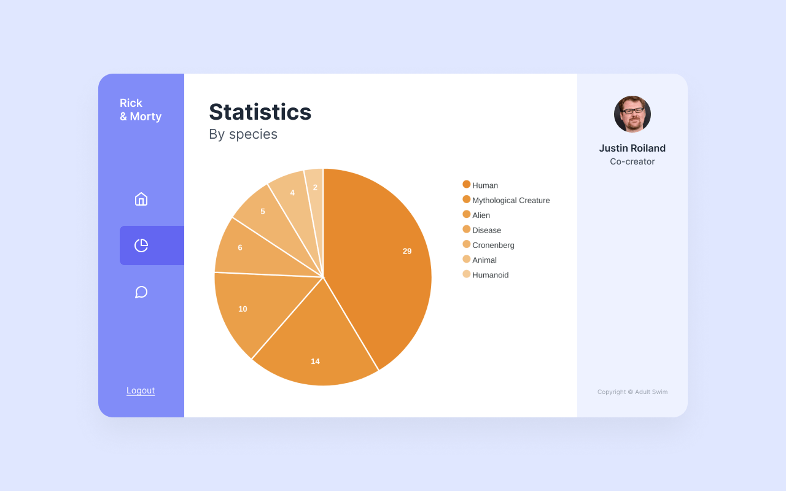

# Rick and Morty dashboard

## Introduction

Welcome to the Metabolic Software front-end developer internship assessment. We estimate it will take you somewhere between 5 and 7 hours depending on your experience. Feel free to take more time if you want to. The primary goal of this exercise is to assess your ability to write well-defined HTML, CSS, and JavaScript using modern patterns and technologies. There are no hard rules or tricky questions.

**We hope you have fun.**

## Brief

We have prepared a skeleton app for you, but please change whatever you want. It's what you normally get with the [Vue CLI](https://cli.vuejs.org), but with some assets you'll need for the assignment.



Recreate the above design, using the existing [pie chart component](src/components/PieChart.vue) and [provided assets](src/assets). You fetch the [episodes](public/data/episodes.json) file to retrieve and transform the data appropriate for this chart. It shows the distribution of the species of all the unique characters in all the episodes. The data is based on the [Rick and Morty API](https://rickandmortyapi.com). The dashboard doesn't have to be responsive or interactive. For example, things like the "Logout" link don't have to work.

**Bonus:** try to get rid of the shadows behind the numbers on the chart.

## The deliverable

A zip of this repository.

## Setting up the project

```
npm install
```

### Start the local development server

```
npm run serve
```
